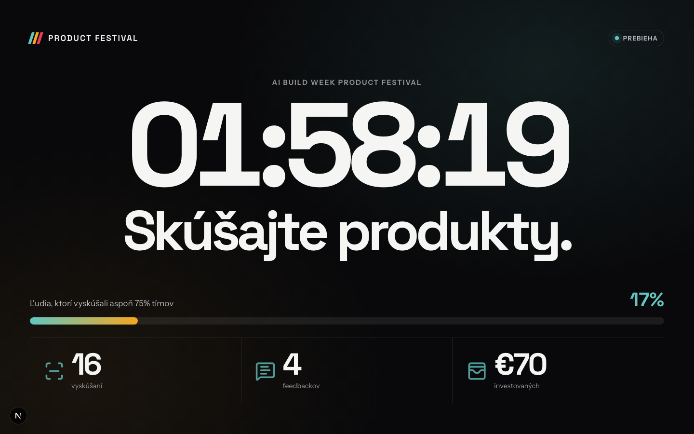
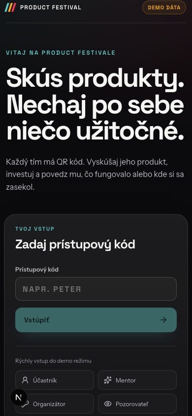
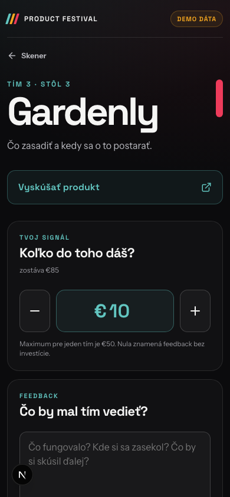
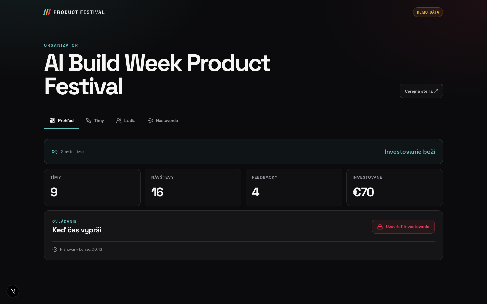

# Product Festival 🎪

Turn demo day into a room full of people actually trying each other’s products.

Each team puts a QR code on its table. People scan it, try the product, invest
some of their fake budget and leave concrete written or recorded feedback. The
projector shows the room moving. At the end, every team gets its own feedback.

It grew out of **AI Build Day**, where participants backed projects they liked
with fake money and QR codes. We adapted the idea for the five-day
**AI Build Week**: instead of spending Friday morning polishing presentations,
teams have to make their product usable by someone else and learn from what
happens.

[Open the AI Build Week festival](https://festival.aibuildweek.com)

## When it is useful

- **A one-day hackathon, like AI Build Day:** turn a row of pitches into quick
  demos, real product trials and a playful signal from the room.
- **A longer program, like AI Build Week:** make “someone else can use it” the
  finish line and send every team home with useful feedback.
- **Accelerators and internal demo days:** let the whole room participate
  instead of separating judges from an audience.

There does not have to be a winner. Here, an investment means: “I want to see
where this goes.”

## What it looks like

The public wall shows shared progress and time, never a team leaderboard.



Participants enter on their phones, then scan the QR code at a team’s table.

<p align="center">
  
  &nbsp;&nbsp;&nbsp;
  
</p>

The organizer controls the event and watches participation in real time.



## What is included

- participant and mentor wallets with configurable budgets;
- team and people CRM with one-time access codes;
- printable and downloadable QR codes for every team;
- browser QR scanner with a manual-code fallback;
- exact investment amounts with `+` / `−` controls;
- written or microphone-recorded feedback;
- editable personal portfolio while investing is open;
- projector wall with countdown, coverage and aggregate activity;
- organizer controls for `draft → open → locked → released`;
- private team receipts after release;
- Supabase Auth, Postgres, Realtime, Storage and RLS;
- a complete local demo mode that needs no account.

## Run the demo

Requires Node.js 20 or newer.

```bash
npm install
npm run dev
```

Open [http://localhost:3000](http://localhost:3000).

Useful demo codes:

| View | Code |
| --- | --- |
| Participant | `PETER` |
| Mentor | `MENTOR` |
| Organizer | `ADMIN` |
| Observer | `GUEST` |

Demo data lives in `localStorage` and syncs between tabs with
`BroadcastChannel`. The organizer can restore the seed from **Nastavenia**.

## Routes

| Route | Purpose |
| --- | --- |
| `/` | Access code and participant home |
| `/scan` | QR camera and manual team code |
| `/t/[code]` | Product, investment and feedback |
| `/portfolio` | Edit the current person's signals |
| `/admin` | Event, team and people controls |
| `/admin/qr` | Print or download team QR cards |
| `/wall` | Public projector view |
| `/summary` | Collective closing numbers |
| `/results` | Private released team feedback |

## Connect Supabase

The app switches from demo mode to Supabase when both public environment
variables are present.

```bash
cp .env.example .env.local
```

```env
NEXT_PUBLIC_SUPABASE_URL=https://YOUR_PROJECT.supabase.co
NEXT_PUBLIC_SUPABASE_PUBLISHABLE_KEY=YOUR_PUBLISHABLE_KEY
NEXT_PUBLIC_EVENT_SLUG=ai-build-week
NEXT_PUBLIC_APP_ORIGIN=http://localhost:3000
```

Then:

1. Create a Supabase project.
2. Enable anonymous sign-ins in Auth.
3. Link the local folder and apply the migration:

   ```bash
   npx supabase login
   npx supabase link --project-ref YOUR_PROJECT_REF
   npx supabase db push
   ```

4. Load `supabase/seed.sql` in the SQL editor for the sample event, or replace
   it with your own event, teams and access codes.
5. Run `npm run dev` again.

The browser receives only the publishable key. Never add a service-role key to
this app. Raw feedback and audio are protected by RLS and a private Storage
bucket. Realtime subscriptions expose only the event lifecycle and aggregate
`event_stats`.

Official references:
[anonymous auth](https://supabase.com/docs/guides/auth/auth-anonymous),
[Realtime database changes](https://supabase.com/docs/guides/realtime/postgres-changes),
[Storage access control](https://supabase.com/docs/guides/storage/security/access-control).

## Event flow

1. **Draft** — add people and teams, assign wallets, print QR cards.
2. **Open** — scanning, visits, investments and feedback are editable.
3. **Locked** — all participant writes stop; private receipts remain hidden.
4. **Released** — each team sees its named amounts, text and recordings.

Transitions only move forward. A public screen never exposes team totals or a
ranking.

## Deploy

Vercel:

```bash
npx vercel
```

Netlify:

```bash
npx netlify-cli deploy
```

Set the four public environment variables in the host and use the final HTTPS
origin for `NEXT_PUBLIC_APP_ORIGIN`. Camera access requires HTTPS outside
localhost.

## Verify

```bash
npm test -- --run
npm run lint
npm run build
```

## License

MIT. See [LICENSE](./LICENSE).
